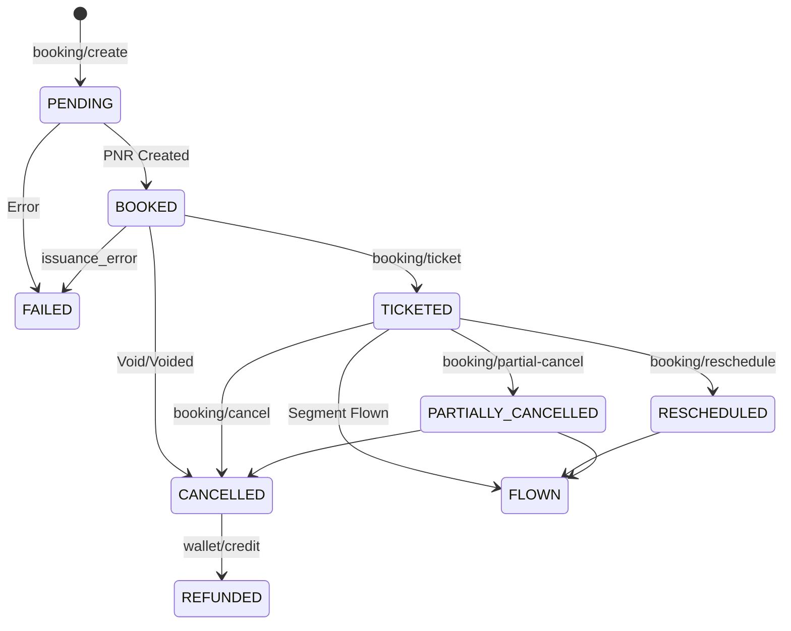

Monitoring the state of a booking is critical for accurate order management. Travomatrix uses a formal state machine to govern the lifecycle of every flight reservation.

## Booking State Machine

Every booking transition is validated against a strict state machine to prevent invalid operations (like issuing a ticket for a cancelled booking).

## Status Values

| Status | Description |
| ------ | ----------- |
| `PENDING` | The booking request is being processed by the provider. |
| `BOOKED` | The PNR has been generated but not yet ticketed. |
| `TICKETED` | The ticket numbers have been issued. The passenger is ready to fly. |
| `FAILED` | The booking or ticketing attempt failed permanently. |
| `CANCELLED` | The booking has been voided or cancelled by the user or administrator. |
| `REFUNDED` | The refund amount has been successfully credited back to the agent's wallet. |
| `FLOWN` | All segments in the booking have been completed. |

## Polling vs. Events

While you can poll this endpoint using the `booking_id` or `pnr`, we recommend using the **X-Request-ID** for tracking asynchronous operations. For production integrations, consider setting up a Webhook listener (Enterprise only).
