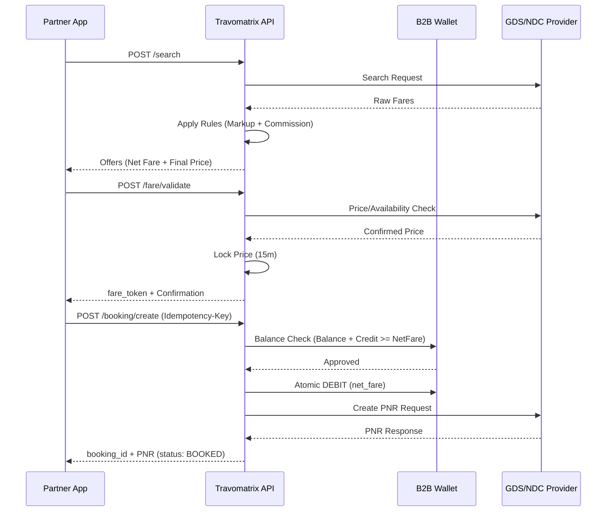

The B2B flow in Travomatrix ensures financial integrity by integrating search, validation, and booking with the agent's wallet.

## End-to-End Sequence

The following diagram illustrates the interaction between your system, the Travomatrix API, and the B2B wallet during a standard search-to-book flow.

## Lifecycle Breakdown

### 1. Search with Commission
The `PricingEngine` identifies the applicable commission rules for the agent. The response includes the `net_fare` (amount to be paid by the agent) and the `final_price` (suggested price for the end customer).

### 2. Fare Validation
Validation is mandatory. It verifies the live availability with the GDS and locks the price. No wallet deduction happens at this stage.

### 3. Booking & Wallet Deduction
When `POST /booking/create` is called:
1.  The system calculates the final `net_fare`.
2.  It checks the agent's wallet: `Balance + Credit Limit >= Net Fare`.
3.  If sufficient, it creates a `DEBIT` transaction and places the booking.
4.  The booking moves from `PENDING` to `BOOKED` once confirmed by the provider.

### 4. Ticketing
After booking, the agent can issue tickets. Some providers issue tickets automatically during booking, while others require a separate `POST /booking/ticket` call.
ing/ticket` call.
